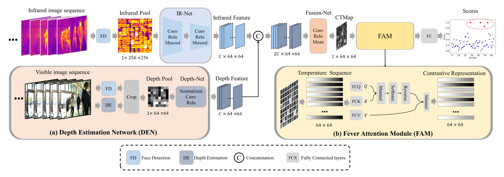

# FeverNet: Enabling Accurate and Robust Remote Fever Screening

**Dataset Link:** http://ieee-dataport.org/documents/extend-thermal-infrared-face-etif

**Tutorial:** Coming soon.

**Reference**
@article{yan2024fevernet,
  title={FeverNet: Enabling accurate and robust remote fever screening},
  author={Yan, Mengkai and Qian, Jianjun and Shao, Hang and Luo, Lei and Yang, Jian},
  journal={Pattern Recognition},
  volume={156},
  pages={110755},
  year={2024},
  publisher={Elsevier}
}
